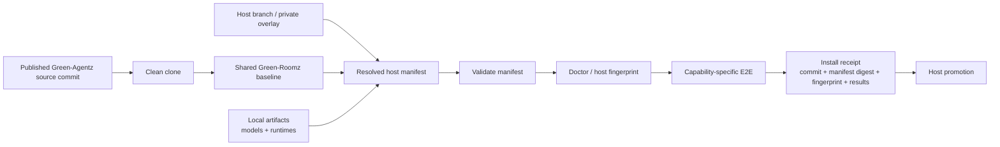
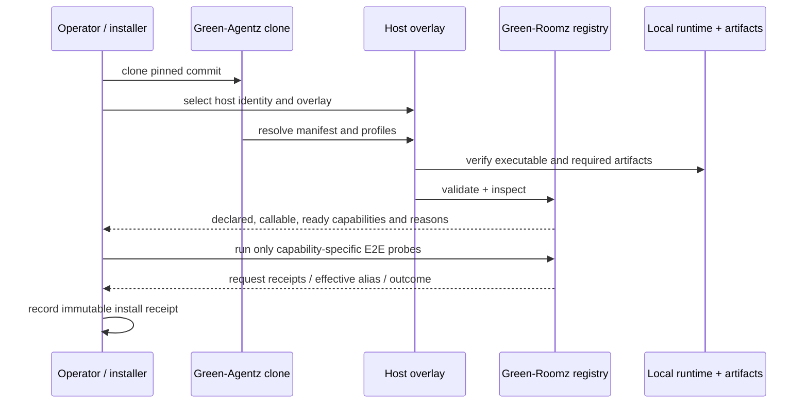

# Fleet Deployment Contract

Status: beta deployment gate. This document records how Green-Agentz can be
installed on another fleet member without treating Shalom's live directory as
the product. It does not introduce Green-Fleetz yet; that future system may
aggregate the resulting receipts and inventory.

## Boundary

Green-Agentz is the canonical source tree. Green-Roomz is its inference
runtime subsystem. A host branch or private host overlay supplies machine-local
paths, hardware-qualified profiles, and local launch settings. Model weights,
native runtimes, logs, API keys, and device credentials are never committed to
the canonical source tree.



The same boundary in compact form:

```text
published commit -> clean clone -> shared baseline --+
                                                    +-> resolved manifest -> validate -> doctor -> E2E -> receipt -> promote
host overlay (paths/profiles/port) ------------------+
local artifacts (never Git) -------------------------+
```

## Required inputs

Every first-run deployment SHALL provide these inputs explicitly:

1. An immutable source commit (or signed tag) and its repository URL.
2. A host identity and a named host branch, such as `host/note9`; host branches
   describe the machine and must not silently become the cross-host baseline.
3. A manifest chosen for that host, with runtime and artifact roots resolved
   for that machine. The default Windows manifest is a Shalom-oriented example,
   not a portable artifact directory contract.
4. A minimum capability target. The smallest useful target is a loopback
   gateway, Node, one local inference runtime, and the resident
   `tool-router-agent`; missing specialists must remain visible as unavailable.
5. A local operator launch method that resolves the checkout relative to its
   own location and does not rely on a particular user profile or prior Codex
   output directory.

Do not copy an existing working tree, use its uncommitted files, or substitute
a legacy runtime tree for the published source commit. Those approaches cannot
produce an auditable receipt.

## Manifest and capability rules



Validation is intentionally not a promise that every declared modality works.
It proves that the manifest schema is sound and reports unavailable artifacts.
The registry's `callable_capabilities`, `ready_capabilities`, and
`capability_readiness` fields are the operational truth; deployment automation
MUST test them before advertising a model or modality as ready.

An initial text-only host may be promoted with unavailable vision, audio,
speech, image-generation, embedding, or reranking aliases, provided its
receipt records those absences. It MUST NOT be described as a completed
multimodal deployment.

## Validation gate

Promotion requires all applicable steps below, in order.

| Gate | Required evidence | Reject or hold when |
|---|---|---|
| Source | commit ID and clean checkout | local edits, tar copies, or unrelated legacy history supply code |
| Manifest | `green-roomz validate --manifest <host-manifest>` | selected manifest has unresolved required runtime/artifact paths or invalid schema |
| Identity | `green-roomz doctor --manifest <host-manifest>` | fingerprint cannot be captured or the declared host overlay does not match the target |
| Capability | `/v1/models` snapshot | advertised callable/ready capability is absent or reasons are missing |
| Text E2E | one locked-alias text completion with the effective-alias receipt | request is rerouted unexpectedly or the backend does not respond |
| Modality E2E | one probe per capability advertised as ready | vision/audio/TTS/image/etc. has only a declaration, not a successful probe |
| Receipt | commit, manifest digest, fingerprint, alias outcomes, timestamp | any result cannot be tied to the installed source and host profile |

The first machine after Shalom should begin with the minimum text capability;
do not make a phone or constrained host wait for unavailable heavyweight
specialists. Conversely, do not promote a fast host's Vulkan profile to another
machine merely because its alias matches.

## Host-overlay policy

Shared source owns stable aliases, manifest schema, capability semantics,
process ownership, and tests. A host overlay owns the following values:

| Overlay field | Examples | Why it is host-scoped |
|---|---|---|
| Artifact/runtime roots | `C:\LocalAI`, Termux runtime directory | filesystem layout and artifact availability differ |
| Runtime command and environment | llama-server path, library path, Vulkan enablement | binary and loader differ by operating system |
| Profile selection | CPU threads, device ID, GPU layers, context limit | hardware qualification is not transferable |
| Gateway binding and port | loopback port, authenticated public binding | local network policy differs |
| Launch integration | `.lnk`, service, Termux command | operator environment differs |
| Monitor topology | replica count, placement budget, effect adapters | a host must not inherit Qodesh's topology by accident |

The overlay must not change a capability from unavailable to ready without a
real local artifact/runtime check and E2E result. It also must not add
Shepherdz authority to gateway inference traffic.

## Current source references

These are the current requirements and implementation points this contract
binds together:

- [Green-Roomz quick start and security binding](../../systems/green-roomz/README.md)
- [Manifest loading and required aliases](../../systems/green-roomz/src/config.mjs)
- [Default Windows manifest and declared artifact paths](../../systems/green-roomz/config/agents.windows.json)
- [Android manifest environment-root convention](../../systems/green-roomz/config/agents.android.json)
- [Registry availability and truthful capability fields](../../systems/green-roomz/src/registry.mjs)
- [Process ownership and profile selection](../../systems/green-roomz/src/process-manager.mjs)
- [Host fingerprint adapters](../../systems/green-roomz/src/hosts/windows.mjs) and [Android sidecar boundary](../../systems/green-roomz/src/hosts/android.mjs)
- [Fleet hardware observations and constrained-device policy](../../systems/green-roomz/docs/fleet-targets.md)
- [Note 9 Termux onboarding constraints](../../systems/green-roomz/docs/note9-termux.md)
- [Security-monitor component map and extraction gate](../../systems/green-roomz/docs/security-monitor-component-map.md)
- [Security-monitor requirements pointer](../../systems/green-roomz/docs/security-monitor-requirements.md)

The security-monitor modules are currently visible in Green-Roomz for review,
but their platform effects remain deliberately bounded. Their eventual
Green-Shepherdz extraction must add explicit per-host effect adapters and
topology enrollment before any fleet-wide authority exists.

## Install receipt shape

An install receipt is a small JSON record stored outside the source commit (or
in a host-private deployment ledger). It contains no secrets and at minimum
has this shape:

```json
{
  "source_commit": "<full Green-Agentz commit>",
  "host_branch": "host/<identity>",
  "manifest_digest": "<green-roomz validate digest>",
  "fingerprint": "<doctor fingerprint id>",
  "gateway": "http://127.0.0.1:<port>",
  "capability_results": {
    "tool-router-agent": "text-e2e-passed",
    "vision-layout-agent": "unavailable: projector missing"
  },
  "installed_at": "<ISO-8601 timestamp>"
}
```

The receipt is the handoff artifact for a later Green-Fleetz inventory. It
describes what truly ran on that particular machine, rather than what another
machine happened to have installed.
