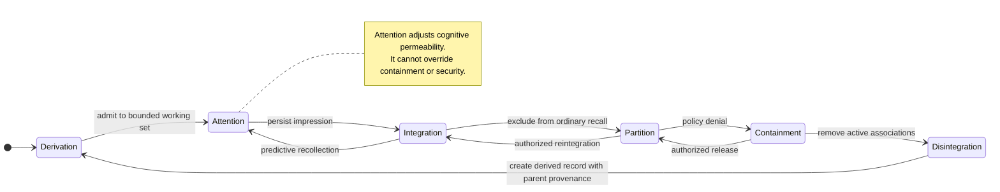
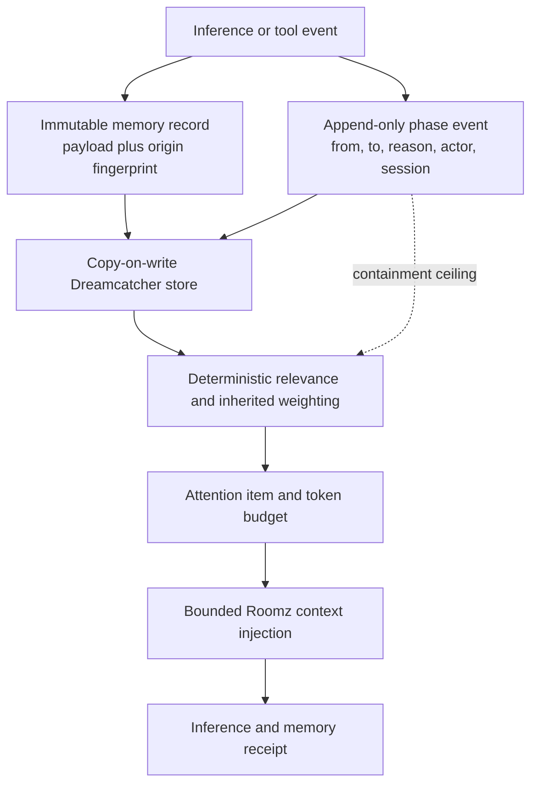

# Memory and Monitor Architecture

## Osmotic memory feedback loop

```text
 derivation ⇄ attention ⇄ integration ⇄ partition ⇄ containment ⇄ disintegration
     ↑                                                                     ↓
     └──────────────────── derived wraparound ─────────────────────────────┘

 Attention changes cognitive permeability within policy.
 Attention never grants identity, capability, or monitor authority.
```



The diagram shows common transitions, not a mandatory clockwise scheduler.
Direct or reverse transitions require explicit policy and append-only events.

## Memory data and control planes



## Protected monitor architecture

```mermaid
flowchart LR
    Producers[Gateway, kernels, and authorized skills]

    subgraph Sentinel[Sentinel — observe]
        Mailbox[Bounded mailbox]
        IPC[Copy-only IPC rings]
        Identity[Secret-free identity]
        Log[Redacted chained log]
    end

    subgraph Council[Council — decide]
        Gate[Transition gate]
        Policy[Capability policy]
        State[Legal state machine]
        Calls[Allowlisted call shapes]
    end

    subgraph Warden[Warden — mediate]
        Respond[Response validation]
        Isolate[Capability isolation]
        Network[Bounded network actions]
        Place[Worker placement]
    end

    Producers --> Mailbox --> IPC --> Identity --> Log
    Log --> Gate --> Policy --> State --> Calls
    Calls --> Respond --> Isolate --> Network
    Isolate --> Place
    Warden -.->|receipt or explicit rejection| Producers
```



## Anti-loop containment

```mermaid
sequenceDiagram
    participant P as Primary agent
    participant I as IRQ controller
    participant D as Dreamcatcher
    participant S as Shepherdz
    participant H as Human operator

    P->>I: repeated action hashes
    I->>I: deterministic loop detection
    I->>D: contain active working set
    D-->>P: preserve durable goal; omit recursive path
    I->>S: append containment event
    alt repeated recovery threshold reached
        S->>P: hard pause
        S->>H: intervention required
    else recovery permitted
        D-->>P: bounded alternate recollection
    end
```

## Requirements

- [Memory Feedback Loop requirements](../memory-feedback-loop-requirements.md)
- [Security monitor component map](../../systems/green-roomz/docs/security-monitor-component-map.md)
- [Security monitor requirements](../../systems/green-roomz/docs/security-monitor-requirements.md)
- [Security monitor audit](../../systems/green-roomz/docs/security-monitor-audit.md)
