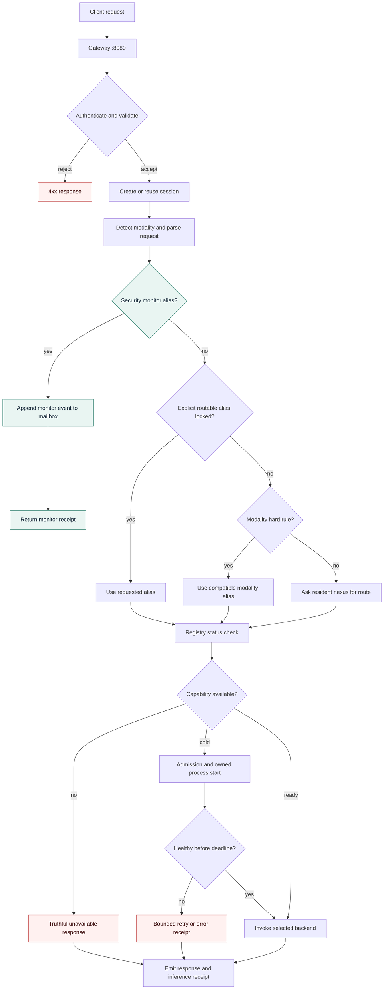
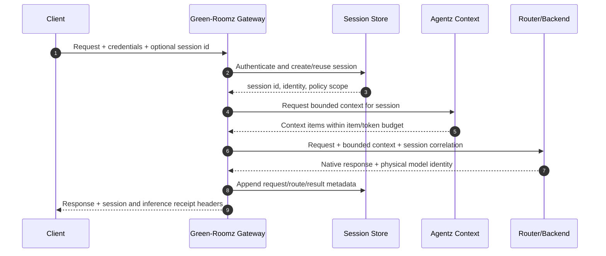
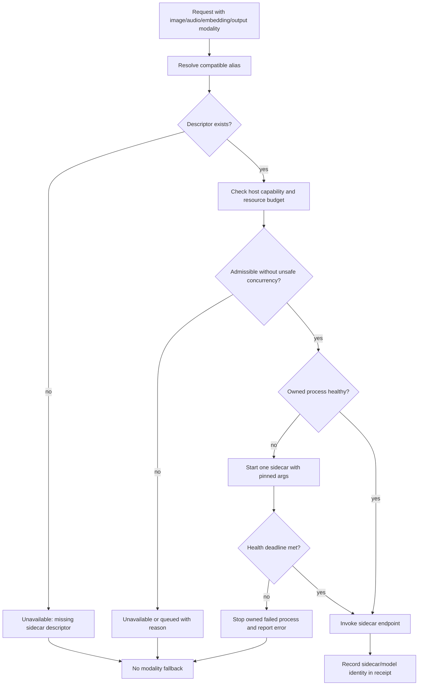
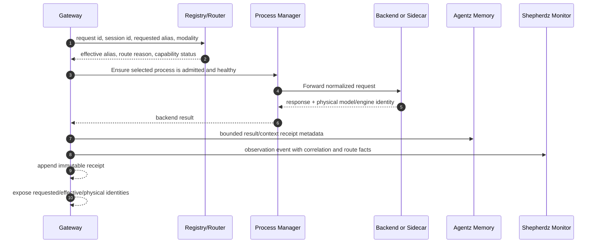
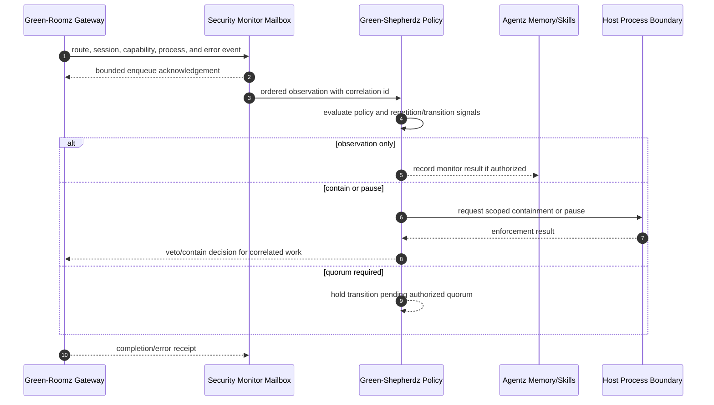

# Runtime Request Flow

This document describes the current Green-Agentz runtime seam. Green-Roomz
owns local inference routing and process lifecycle; Agentz owns skills and
cognitive memory; Green-Shepherdz observes and constrains security-sensitive
events. Future Green-Fleetz/swarm coordination remains outside this request
path.

```text
client
  |
  v
gateway :8080 -- authenticate/correlate --> session store
  |                                      |
  | detect modality + requested alias    +--> bounded Agentz context
  v
registry/status -- truthful capability check
  |
  +--> monitor mailbox (observe/contain/veto when required)
  |
  +--> owned process manager -- ready --> native backend or sidecar
                                      |
                                      v
                         response + inference receipt
```

## Boundaries and invariants

- A request has one session correlation, one routing decision, and one
  inference receipt. Hops and fallbacks are recorded rather than hidden.
- `model` is a functional alias. The receipt also records the physical model
  or sidecar that actually served the request.
- A manifest declaration is not proof of availability. Runtime/artifact
  checks must produce the exposed status.
- Gateway-accepted input describes the protocol surface; it does not grant a
  native capability that the selected backend does not implement.
- A cold process may be started only by the owned process manager after
  admission and health checks. Unavailable capability returns a truthful error;
  it must not silently become a different modality.
- Attention and memory context are bounded inputs. They never grant skill,
  filesystem, identity, or Shepherdz authority.

## Request routing

The gateway makes the routing decision before it forwards inference. Explicit
alias locking is deterministic; otherwise the nexus may select a routable
specialist according to policy. Security-monitor traffic uses its mailbox path.



## Sessions and bounded context

Sessions carry identity, modality, selected alias, and correlation. Agentz
memory can provide bounded context through its interface, but Roomz does not
own durable cognitive records.



Session reuse does not authorize cross-identity memory access. A fork or
swarm-received impression retains its origin and inherited weighting; the
receiver applies its own policy before context injection.

## Capability truthfulness

The registry exposes what is callable on this host at this moment. Native
capabilities, accepted protocol modalities, and availability are separate
fields.

```mermaid
flowchart LR
    A[Manifest alias] --> B[Validate schema and policy]
    B --> C[Check runtime command]
    B --> D[Check required artifacts]
    B --> E[Check backend/sidecar descriptor]
    C --> F[Registry status]
    D --> F
    E --> F
    F --> G{All required checks pass?}
    G -- no --> H[availability: unavailable\nwith reasons]
    G -- yes, process absent --> I[availability: cold]
    G -- yes, process healthy --> J[availability: ready]
    H --> K[/v1/models and /health]
    I --> K
    J --> K
    K --> L[Client chooses a truthful route]
    M[Gateway-accepted input] --> N[Protocol validation only]
    N -. never implies .-> J
```

`native_capabilities_are_truthful` means the native list is backed by the
selected implementation, not merely by an input format the gateway can parse.
If a logical alias points at a text-only backend, it must not claim that a
vision, audio, embedding, or image-generation request was executed natively.

## Sidecars and resource safety

Sidecars are explicit, owned processes. Their lifecycle is independent of the
resident text nexus, and a failed or missing sidecar must not be hidden by
silently sending its request to a text model.



The resident CPU nexus may remain available while a sidecar is cold, but it
does not make that sidecar's capability ready. Admission, process ownership,
and cancellation prevent unrelated services from being started or terminated.

## Inference receipts

Receipts make alias switching and physical execution auditable. They are also
the seam used by memory and monitor components without allowing either to
rewrite the runtime result.



At minimum, a receipt should correlate the request, session, requested alias,
effective alias, physical model or sidecar, route reason, modality,
availability decision, hop list, and timestamps. Hashes provide integrity and
correlation; they do not by themselves prove authorship.

## Monitor observation

The monitor path is asynchronous and bounded. Green-Shepherdz may observe,
contain, veto, or require quorum for security-relevant events. It cannot gain
authority from a memory item, a skill binding, or an inference response.



Monitor observation is not a replacement for host isolation, authentication,
or process ownership. Cognitive containment preserves the memory record and
audit trail; it does not authorize physical deletion or broaden the caller's
scope.

