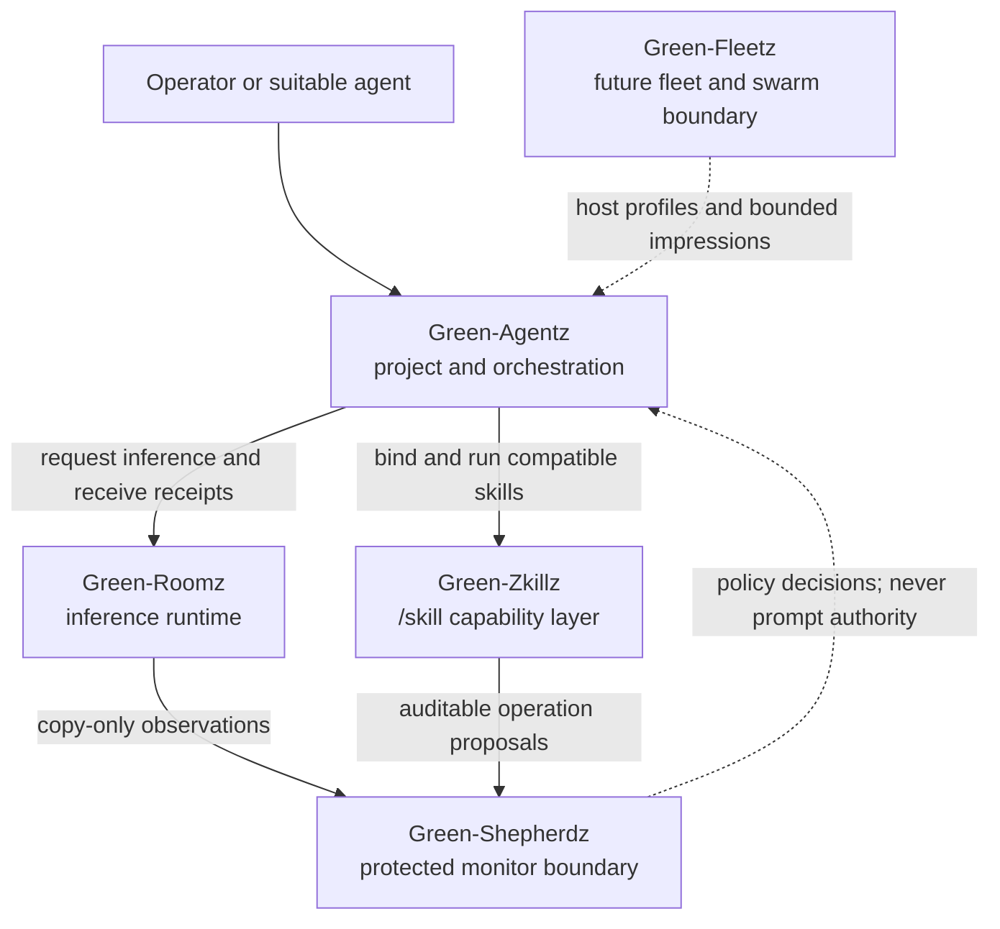
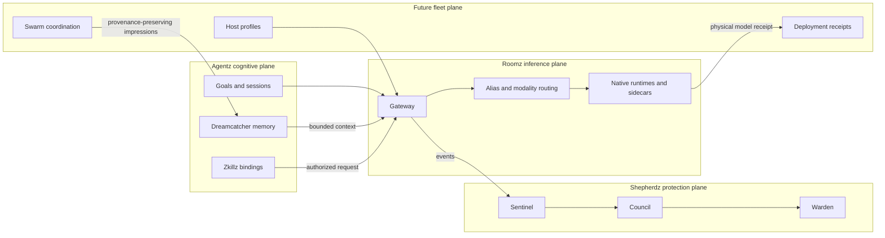

# Green-Agentz System Overview

## Compact architecture

```text
Green-Agentz
├── Green-Roomz       inference gateway, routing, sessions, native runtimes
├── Green-Zkillz      portable `/skill` capability layer
├── Green-Shepherdz   protected monitor system (reserved extraction)
│   ├── Sentinel      observe and correlate
│   ├── Council       evaluate and authorize
│   └── Warden        mediate bounded effects
└── Green-Fleetz      future fleet/swarm coordination boundary
```

The names describe ownership boundaries. They do not imply that every component
is already a separate daemon or repository.

## Ecosystem architecture



## Responsibility boundary



## Boundary rules

1. Green-Roomz owns inference lifecycle, not durable cognitive memory.
2. Green-Zkillz binding grants no authority by itself.
3. Sentinel observation does not authorize Warden effects.
4. Cognitive attention cannot cross security or identity boundaries.
5. Green-Fleetz remains a planning boundary until its swarm and host ownership
   are jointly specified.
